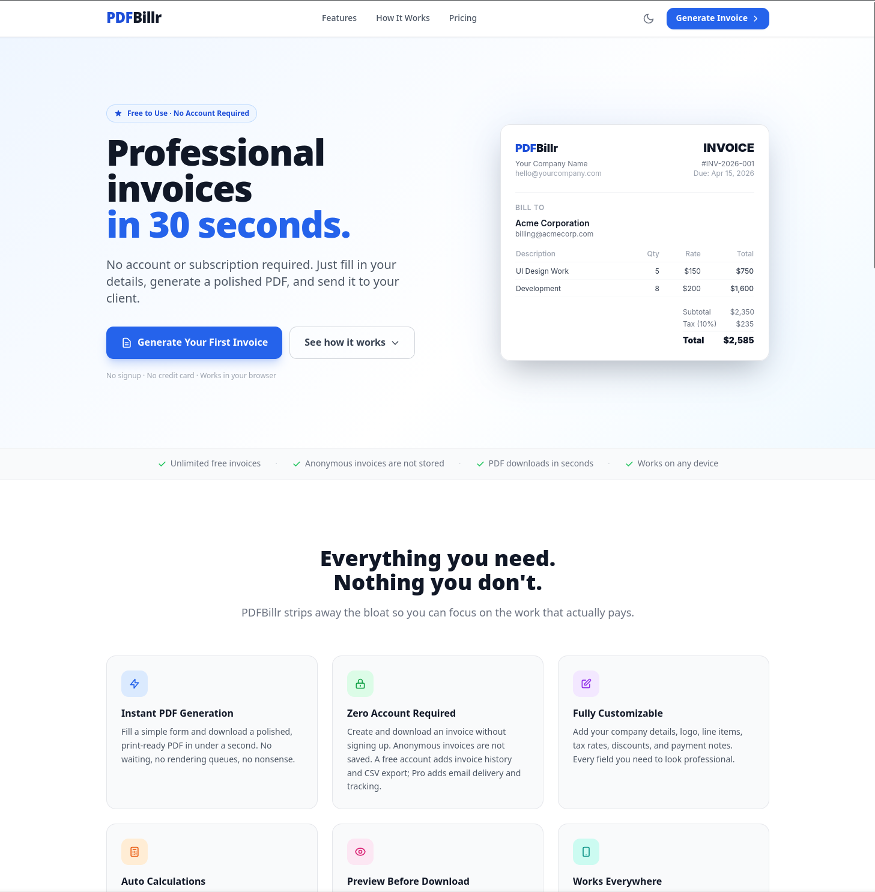
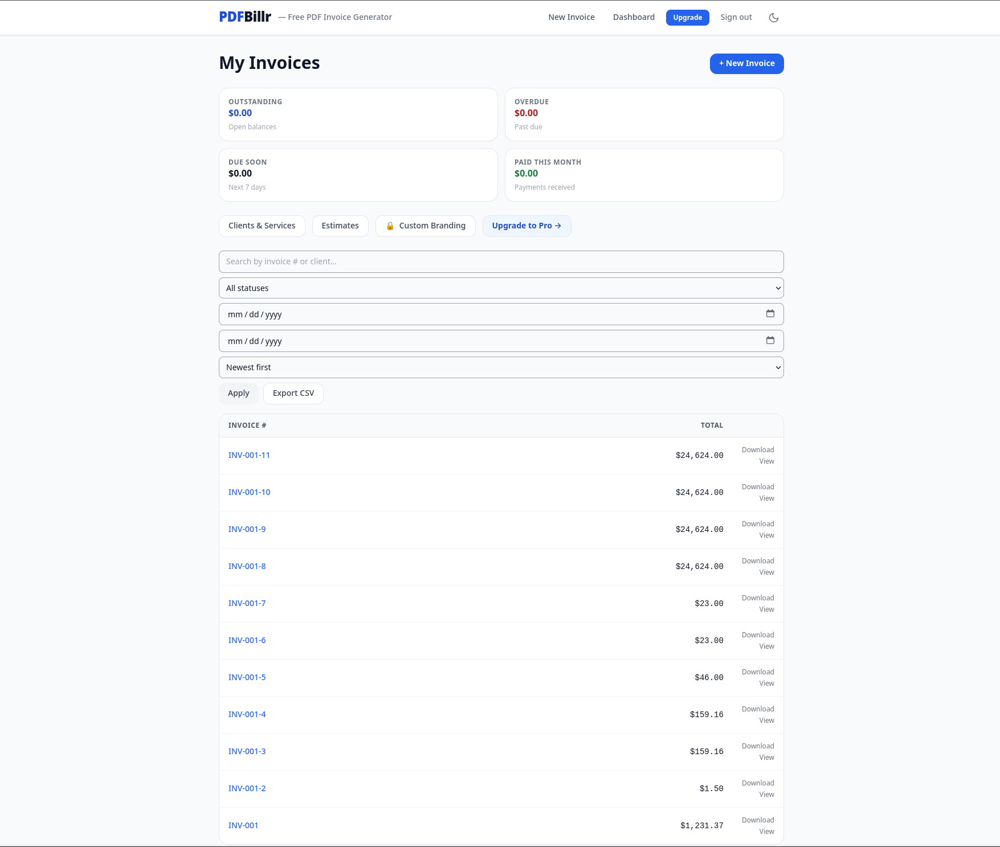
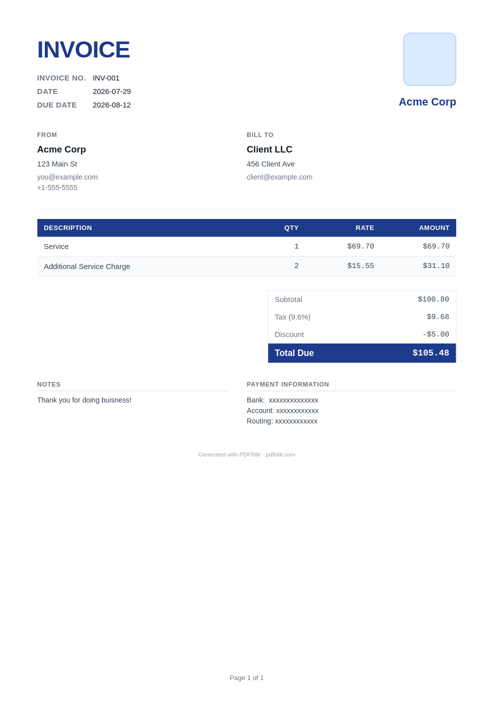

# PDFBillr

> A production-minded invoicing SaaS built end to end—from product UI and PDF generation to payments, background work, containers, and deployment safeguards.

PDFBillr helps freelancers and small businesses create professional invoices and estimates, manage clients, track receivables, and share documents. It is a functional application and a polished portfolio project: the goal was to demonstrate the practical work required to build, deploy, and operate a SaaS, not simply to ship a set of screens.

## Product preview

<p align="center">
  
</p>

<table>
  <tr>
    <td width="64%"></td>
    <td width="36%"></td>
  </tr>
  <tr>
    <td align="center">Invoice dashboard</td>
    <td align="center">Generated PDF</td>
  </tr>
</table>

## What it can do

- Generate polished PDF invoices in multiple currencies
- Create estimates, share them through protected links, and convert accepted estimates into invoices
- Maintain client records, service catalogs, invoice history, and CSV exports
- Track draft, sent, partial, paid, void, and overdue invoices; record manual payments
- Offer Pro features through Stripe, including branding, email delivery, reminders, recurring invoices, and additional PDF themes

Payment collection stays with the merchant: a **Pay now** button directs the recipient to the merchant's own secure payment destination. PDFBillr does not process card payments or perform currency conversion.

## What this project demonstrates

| Product engineering | Production operations |
| --- | --- |
| Flask + Jinja application design | Dockerized web, migration, and scheduler services |
| SQLAlchemy data modeling and Alembic migrations | Health checks, request IDs, safe logging, and backups guidance |
| Server-side validation and WeasyPrint PDFs | One dedicated, idempotent background worker for reminders and recurrences |
| Authentication, authorization, and CSRF protection | Non-root containers and locked dependencies |
| Stripe subscriptions and verified webhooks | Explicit production configuration and deployment checks |

In other words: PDFBillr reflects the full SaaS lifecycle—build, secure, deploy, operate, and evolve.

## Project docs

- [Architecture](docs/architecture.md) — service boundaries and runtime design
- [Deployment guide](docs/deployment.md) — environment, release, and verification steps
- [Contributing](CONTRIBUTING.md) and [security policy](SECURITY.md) — local workflow and responsible disclosure

## Architecture

```text
Browser → Flask routes → validation & business logic → SQLAlchemy → database
                      ↘ Jinja / WeasyPrint PDFs
                      ↘ Stripe / SMTP

Dedicated scheduler → recurring invoices, reminders, and delivery retries
```

The application is organized around Flask blueprints for public, auth, dashboard, client, estimate, export, and billing flows. `models.py` holds the core SaaS data model; `scheduler_worker.py` is the single long-running background process.

## Run locally

Requires Python 3.12. SQLite is the default local database.

```bash
python3.12 -m venv .venv
.venv/bin/pip install --require-hashes -r requirements-dev.lock
cp .env.example .env
```

Set a unique `SECRET_KEY` in `.env`, then initialize and start the app:

```bash
set -a && . ./.env && set +a
AUTO_CREATE_DB=false .venv/bin/flask --app app db-bootstrap
.venv/bin/python app.py
```

Open <http://127.0.0.1:8000>. Stripe and SMTP may remain as development placeholders unless you want to explore those flows with test credentials.

Run the checks with:

```bash
make check
```

## Run with Docker

Compose runs database migrations before starting the web app and exactly one scheduler worker.

```bash
export SECRET_KEY="$(python -c 'import secrets; print(secrets.token_hex(32))')"
mkdir -p instance static/logos
docker compose up --build
```

Visit <http://localhost:8080/pdfbillr>. The SQLite database and uploaded logos persist in `instance/` and `static/logos/`; back up both as application data.

## Production notes

Before deploying, configure a strong `SECRET_KEY`, `APP_ENV=production`, a canonical HTTPS `PUBLIC_BASE_URL`, and `TRUSTED_HOSTS`. Add SMTP, Stripe, and a shared rate-limit store only when those integrations are enabled. `memory://` rate limiting is suitable only for a single web process.

- `GET /health/live` verifies that the process is running.
- `GET /health` checks database, PDF-rendering, and rate-limit readiness.
- Responses include `X-Request-ID` for support and incident tracing.

Run migrations once as part of deployment, keep a single scheduler worker, and regularly back up the database and uploads. SQLite is the verified default; validate PostgreSQL and concurrent deployment behavior for a larger production topology.

## Project status

PDFBillr is intentionally presented as a production-minded portfolio project: functional, deployable, and designed to make the behind-the-scenes engineering visible. Known follow-up decisions and migration work are documented in [the engineering review](docs/engineering-review.md).
