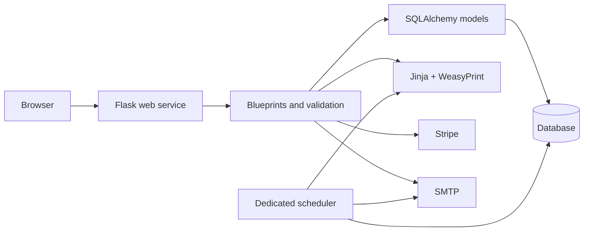

# Architecture

PDFBillr is a server-rendered Flask SaaS with one web process and one dedicated
scheduler process. The web application owns request/response work; the
scheduler owns recurring and retryable background work.

## Application boundaries

| Area | Responsibility |
| --- | --- |
| `blueprints/` | Public invoice flow, authentication, dashboard, billing, clients, estimates, and exports. |
| `models.py` | Persistent SaaS entities: users, invoices, payments, estimates, subscriptions, branding, and durable delivery records. |
| `utils/` | Financial calculations, PDF rendering, URL and upload handling, entitlement checks, and scheduled work. |
| `migrations/` | Alembic schema history and explicit database upgrades. |
| `scheduler_worker.py` | The single long-running scheduler process for reminders, recurring invoices, and delivery retries. |

## Runtime design

Docker Compose runs a one-shot migration service before starting the web and
scheduler services. The application container runs as a non-root user. The
database and uploads live in persistent storage; neither belongs in an image.

The system intentionally separates liveness from readiness. `/health/live`
checks whether the process is running, while `/health` checks database access,
PDF rendering, and rate-limit readiness. Each response carries an
`X-Request-ID` to support incident investigation.

For deployment steps and operational guardrails, see
[deployment.md](deployment.md).
